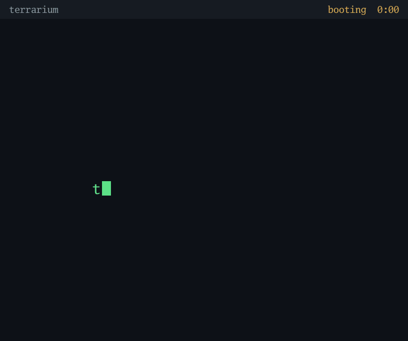
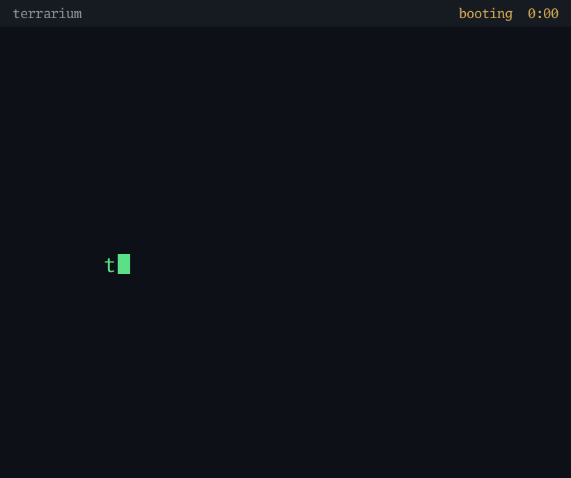
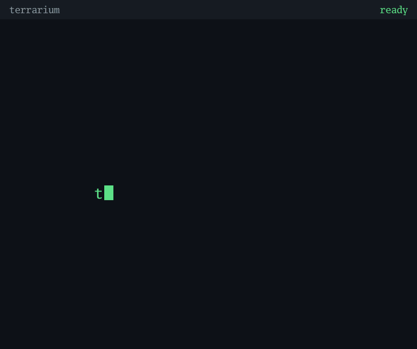

<div align="center">

# terrarium

**Real, disposable computers in seconds, for you and your AI agent.**

Fork a fresh Windows or Linux machine, use it, break it, reset it to spotless in
the time it takes to read this.

[](https://github.com/chryaner/terrarium/actions/workflows/ci.yml)
[](go.mod)
[](LICENSE)



</div>

## Why

Containers are the right way to ship a Linux service and the wrong way to test a
whole **system**: every container borrows the host's kernel, so a build that
passes in one can still fail on real hardware. VMs have always fixed that. What
they lacked was the container workflow: image, run, throw away.

terrarium is that workflow on top of the VirtualBox you already have. Fork a
golden image in a tenth of a second. Wreck the fork and put it back in seconds.
Do it from the command line, or hand the same power to an AI agent over MCP. It
ships no virtualization code, wraps `VBoxManage`, and never touches a VM it did
not create.

## Contents

- [Features](#features)
- [Install](#install)
- [Quick start](#quick-start)
- [How fast](#how-fast)
- [Images](#images)
- [What it is not](#what-it-is-not)

## Features

Every recording below is real: real commands, real screenshots read from the
guest's video memory, and a timer that shows real wall-clock seconds.
[docs/demo](docs/demo/README.md) explains how they are made.

<table>
<tr>
<td width="50%" valign="top" align="center">

**Fork Windows: a desktop from cold in ~40s**


</td>
<td width="50%" valign="top" align="center">

**Fork Linux: SSH answering in ~20s**



</td>
</tr>
<tr>
<td width="50%" valign="top" align="center">

**Brick it, then revert it: clean again in 13s**



</td>
<td width="50%" valign="top" align="center">

**Claude wins Minesweeper on XP: no SSH, nothing installed**


</td>
</tr>
</table>

### How it compares

|                                          | **terrarium** | Docker | Vagrant | Hyper-V | Multipass | WSL2 |
| ---------------------------------------- | :-----------: | :----: | :-----: | :-----: | :-------: | :--: |
| a real, whole machine (its own kernel)   |      ✅       |   ❌   |   ✅    |   ✅    |    ✅     |  ❌  |
| Windows guests                           |      ✅       |   ❌   |   ✅    |   ✅    |    ❌     |  ❌  |
| legacy guests (XP era)                   |      ✅       |   ❌   |   ❌    |   ❌    |    ❌     |  ❌  |
| new machine in one command, seconds      |      ✅       |   ✅   |   ❌    |   ❌    |    ❌     |  ❌  |
| reset to clean state in seconds          |      ✅       |   ✅   |   ❌    |   ❌    |    ❌     |  ❌  |
| environment shared as a small text file  |      ✅       |   ✅   |   ✅    |   ❌    |    ❌     |  ❌  |
| drives GUI-only guests (screen, mouse)   |      ✅       |   ❌   |   ❌    |   ❌    |    ❌     |  ❌  |
| AI agent tools built in (MCP)            |      ✅       |   ❌   |   ❌    |   ❌    |    ❌     |  ❌  |
| production workloads                     |      ❌       |   ✅   |   ❌    |   ✅    |    ❌     |  ❌  |
| runs on any host OS                      |      ❌       |   ✅   |   ✅    |   ❌    |    ✅     |  ❌  |

If your work fits in a container, use Docker. When it needs a real, whole
machine you can break and un-break - and the last two rows are prices you can
pay - the first column is the point of this project.

### A dev environment per project

```yaml
# terrarium.yaml, committed in your repo
image: ubuntu-24.04
cpus: 4
memory: 4096
```

`terrarium up` forks an env named after the project, shares the project folder at
`/work` in the guest, and adds it to `~/.ssh/config`, so `ssh <project>` works
and VS Code Remote-SSH sees it one click away. `down` parks it, `up` brings it
back, `revert` resets it.

### Your AI agent gets real computers

```console
$ claude mcp add terrarium -- terrarium mcp
```

The same binary is an MCP server: everything above as tools, plus screenshot,
keyboard and mouse injection. On connect it tells the agent to run `doctor`
first and to report what is missing instead of flailing. A disposable VM is a
good place to let an agent work: a real kernel, and nothing it does escapes
the fork, because `revert` un-happens everything.

- "Fork a clean env, build the project in it, tell me what the README missed."
- "Install our app on the Windows env and screenshot each step."

### Drive guests that have no SSH

`screenshot`, `click`, `scroll`, `type`, and `keys` drive the screen, mouse
and keyboard through the hypervisor - nothing installed in the guest, no
network needed, no guest additions.
This is how you get through an installer, a boot loader, a login screen, or an
OS too old to help, and how an agent drives a machine before it can even log
in. The mouse is the one thing `VBoxManage` has no verb for, so `click` and
`scroll` talk to VirtualBox's COM API directly; everything else shells out.
For Windows guests with SSH, `terrarium rdp` opens a full desktop already
logged in.

The agent recording above is exactly that: a live session where Claude played
Minesweeper on a Windows XP fork - an OS no modern agent tooling can reach -
deciding every click from the previous screenshot. It cleared the board with
no losses and no guessing, landed on XP's own fastest-time leaderboard, then
ran `revert`, and even the high score never happened. Nothing was scripted.

## Install

```console
$ scoop bucket add terrarium https://github.com/chryaner/terrarium
$ scoop install terrarium
```

Or, with Go >= 1.25, `go install github.com/chryaner/terrarium/cmd/terrarium@latest`,
or `go build -o terrarium ./cmd/terrarium` from a clone.

Requires a Windows host with [VirtualBox](https://www.virtualbox.org/) 7.x
(`VBoxManage` on `PATH`). Then check the machine is ready:

```console
$ terrarium doctor
```

Linux images download themselves. Windows images build from an installation
ISO you download yourself, since Microsoft's media cannot be redistributed -
see [Images](#images) for where to put it.

## Quick start

```console
$ terrarium get debian-12          # build a golden: download, boot, snapshot (~40s)
$ terrarium fork debian-12 t1      # a throwaway machine, SSH-ready in ~20s
$ terrarium exec t1 -- uname -a
$ terrarium ssh t1
$ terrarium revert t1              # back to clean in seconds
$ terrarium rm t1
```

`down` and `start` park and wake an env without losing it. `fork --ttl 2h`
marks an env to expire, and `terrarium gc` removes the expired ones (and any
whose VM you deleted by hand).

## How fast

| operation                               | measured   |
| --------------------------------------- | ---------- |
| fork a golden (linked clone)            | **0.1 s**  |
| Linux fork to SSH answering (cold)      | ~20 s      |
| Windows fork to a usable desktop (cold) | ~40 s      |
| revert to clean state (RAM resume)      | **8-11 s** |
| snapshot a running machine (RAM)        | 4 s        |
| disk per fork                           | 28-48 MB   |
| build a Linux golden from scratch       | ~40 s      |

Measured on a desktop (i9-14900K, NVMe, VirtualBox 7.2). Your numbers will
differ; the shape will not. Forks are linked clones: they share the golden's
disk, which is why cloning costs a tenth of a second and megabytes, not
minutes and gigabytes.

## Images

A golden is the vendor's own published image plus a few lines of YAML, so the
bytes always come from the distribution that maintains them. Adding an image is
a pull request with one file.

### Linux: downloaded for you

`terrarium get <name>` downloads the official cloud image, seeds it with a
generated SSH key, boots it once, and snapshots it. About a minute each.

| recipe          | downloads from          |
| --------------- | ----------------------- |
| `ubuntu-24.04`  | cloud-images.ubuntu.com |
| `ubuntu-22.04`  | cloud-images.ubuntu.com |
| `debian-12`     | cloud.debian.org        |
| `debian-13`     | cloud.debian.org        |
| `alma-9`        | repo.almalinux.org      |
| `rocky-9`       | dl.rockylinux.org       |
| `fedora-44`     | fedoraproject.org       |
| `opensuse-16.0` | download.opensuse.org   |

### Windows: bring your own ISO

There is no Windows cloud image and Microsoft's media cannot be redistributed,
so you download the ISO once and terrarium runs the real installer unattended:

1. Download the installation ISO from Microsoft.
2. Save it in `%LOCALAPPDATA%\terrarium\isos\`, named for the recipe:
   `win10.iso`, `winxp.iso`.
3. `terrarium get win10`. Fully unattended: about ten minutes for win10, seven
   for XP.

`win10` and `winxp` ship today. XP predates OpenSSH, so its
forks are driven through screenshot, click, type and keys rather than `exec`,
and its recipe needs a product key you supply in a local override. Recipe
details, private mirrors and the unattended-install internals are in
[docs/DESIGN.md](docs/DESIGN.md).

### Layer your own

A recipe can build on another image instead of on media: `from` names the
base, `setup` runs commands in a fork of it, and the result is flattened into
a new golden. The YAML file is the shareable artifact - a teammate with the
same file builds an equivalent machine from their own base, so no disk image
(and no Windows license) ever changes hands.

```yaml
# %LOCALAPPDATA%\terrarium\recipes\team-dev.yaml
name: team-dev
from: debian-12
setup:
  - sudo apt-get update
  - sudo apt-get install -y git build-essential
```

`terrarium get team-dev` builds it in seconds on top of an existing base. For
state you made by hand rather than by script, `terrarium promote <env> <name>`
flattens a configured env into a golden directly. `terrarium rm --golden
<name>` removes an image you are done with.

## What it is not

- **Not cross-platform yet.** The host must be Windows with VirtualBox. Every
  hypervisor call sits behind one package by design, so a QEMU or Hyper-V driver
  is a planned door, not a promise.
- **Not for production.** Forks are cattle for development and testing.
- **Not a secrets manager.** A Windows golden's password is stored in plain text
  locally and is briefly visible on the `VBoxManage` command line during the
  install. Use a throwaway password.

## License

[Apache-2.0](LICENSE). Recipes, issues and field reports welcome, the most useful
contribution is a recipe for an image people actually use.
